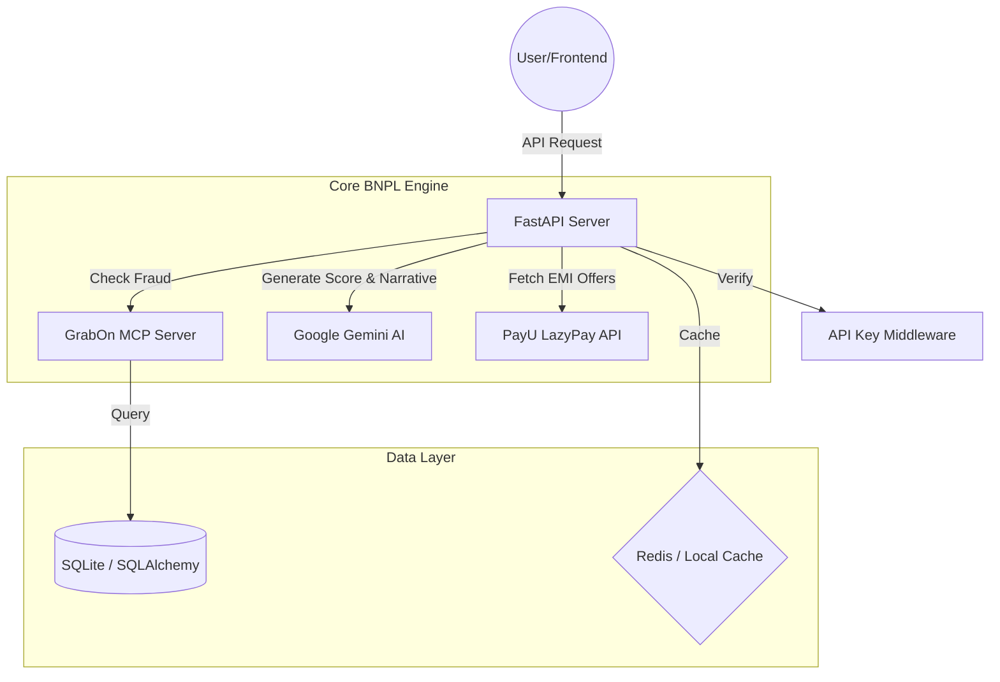
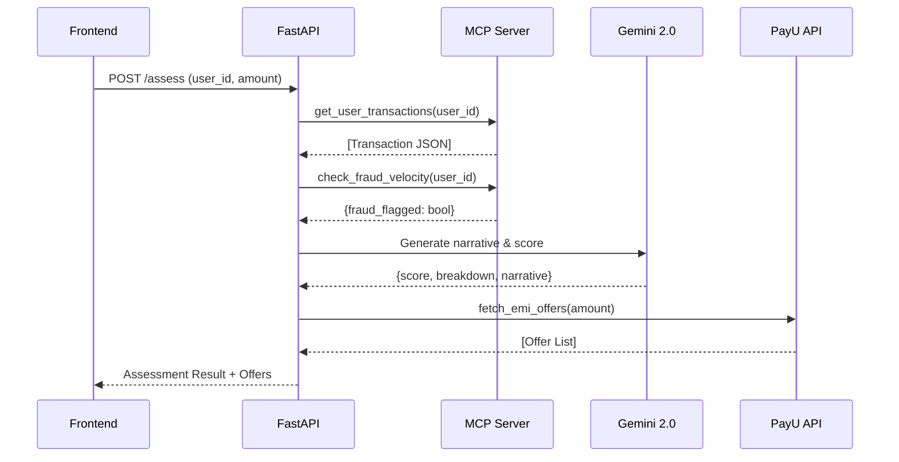

# GrabScore AI - Backend Architecture

GrabScore is an AI-powered Buy Now, Pay Later (BNPL) eligibility engine. It leverages transaction data to perform behavioral credit scoring using LLMs (Google Gemini 2.0 Flash) and integrates with PayU LazyPay for real-time EMI processing.

## 🏗️ System Architecture

The GrabScore backend follows a modular service-oriented architecture, designed for high performance and low-latency AI inference.



## 🛠️ Component Breakdown

### 1. API Layer (`app/api/`)
- **[Credit API](file:///GrabScore-AI/grabscore-backend/app/api/credit.py)**: The central orchestrator. Handles `/assess` and `/payu/initiate` endpoints.
- **[Users/Transactions](file:///GrabScore-AI/grabscore-backend/app/api/transactions.py)**: Manage core entities and demo data retrieval.

### 2. Logic Layer (`app/services/`)
- **[Gemini Service](file:///GrabScore-AI/grabscore-backend/app/services/gemini_service.py)**: Directly integrates with Google Generative AI. It transforms raw transaction JSON into a structured risk narrative and behavioral score.
- **[PayU Client](file:///GrabScore-AI/grabscore-backend/app/services/payu_client.py)**: Implements the PayU Sandbox redirect flow, including SHA-512 hash generation and EMI plan selection.
- **[Credit Scoring Engine](file:///GrabScore-AI/grabscore-backend/app/services/credit_scoring.py)**: A deterministic fallback engine that computes scores across 6 dimensions: frequency, redemption, diversification, growth, returns, and velocity.

### 3. Data Integration Layer
- **[MCP Server](file:///GrabScore-AI/grabscore-backend/mcp_server.py)**: Implements the Model Context Protocol. Acts as a standardized bridge to fetch transaction history and perform fraud velocity checks, ensuring the LLM receives clean, structured data.

## 🔄 Core Workflows

### Credit Assessment Flow


### Payment Processing (Redirect Flow)
1. **Initiation**: Backend generates a unique `txnid`, `hash` (SHA-512), and `bankcode` (e.g., `LPEMI03`).
2. **Redirect**: Frontend submits a hidden form POSTing to `https://test.payu.in/_payment`.
3. **Completion**: PayU redirects the user back to the backend-provided `SURL`/`FURL` with status parameters.

## ⚙️ Setup & Tech Stack

- **Framework**: FastAPI (Asynchronous Python)
- **AI**: Gemini 2.0 Flash
- **Database**: SQLAlchemy with SQLite (dev) / PostgreSQL (prod ready)
- **Caching**: Redis (TTL: 5m for assessments, 24h for AI narratives)

### Quick Start
```bash
# Install dependencies
pip install -r requirements.txt

# Configure .env (Need GEMINI_API_KEY)
# Start development server
uvicorn app.main:app --reload
```

## 📡 API Endpoints Summary

| Endpoint | Method | Description |
|----------|--------|-------------|
| `/api/v1/credit/assess` | POST | Core eligibility check + AI narrative |
| `/api/v1/credit/payu/initiate` | POST | Generate PayU payment parameters |
| `/api/v1/credit/score/{user_id}`| GET | Quick cached score lookup |
| `/api/v1/health` | GET | Logic/Database health check |

## 📄 License
Internal Development - GrabScore AI Project.
